<div align="center">

# KAdmin 人资管理系统

**一站式企业人力资源与移动办公平台**

基于 Spring Boot 3 + Vue 3 + UniApp 打造,PC 后台管理 + 移动端(H5 / 微信小程序)双端覆盖

`组织架构` `人事档案` `GPS 考勤` `审批流` `时光动态` `即时聊天`

</div>

---

## 界面展示

### 后台管理端(PC)

| 仪表盘 | 员工管理 |
| --- | --- |
| 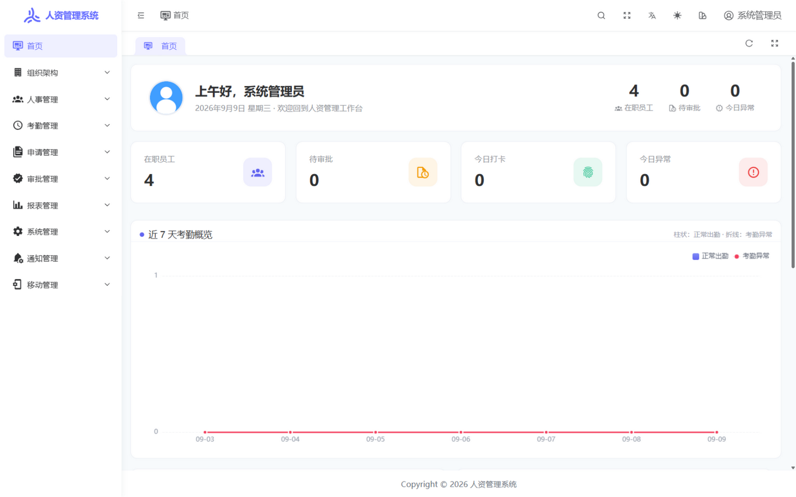 | 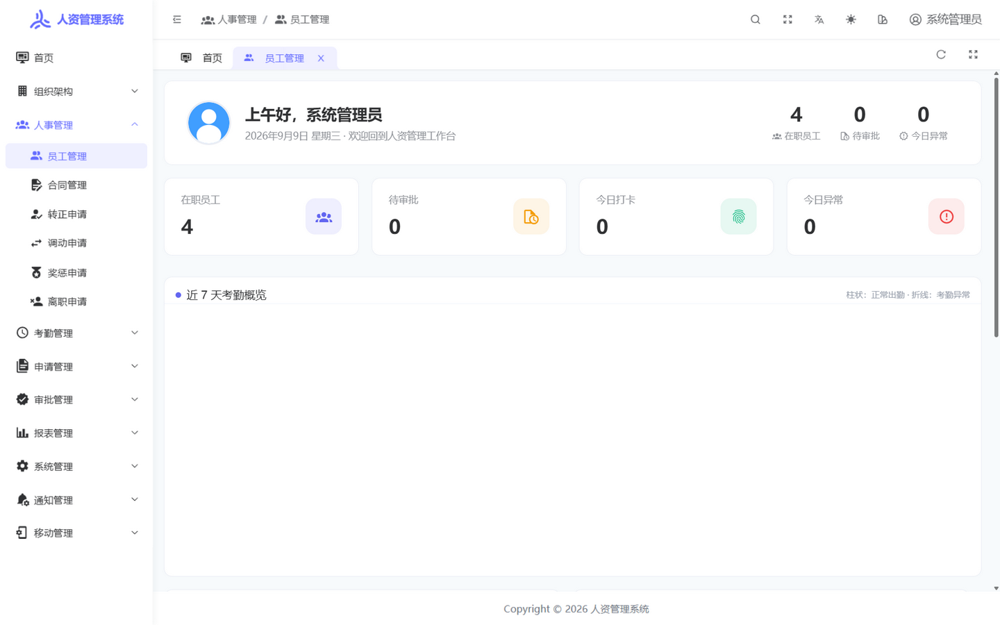 |

| 考勤管理 | 用户管理 |
| --- | --- |
| 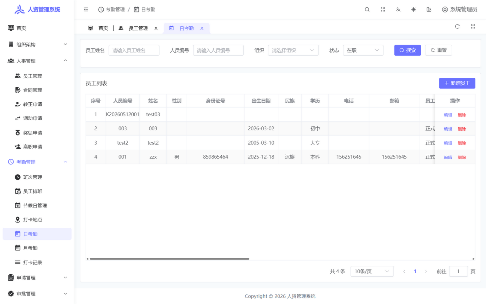 | 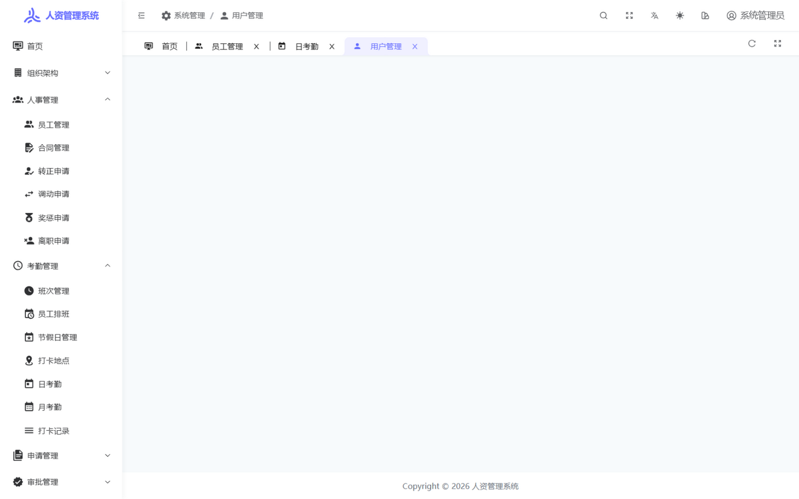 |

| 移动端菜单配置 | 登录页 |
| --- | --- |
| 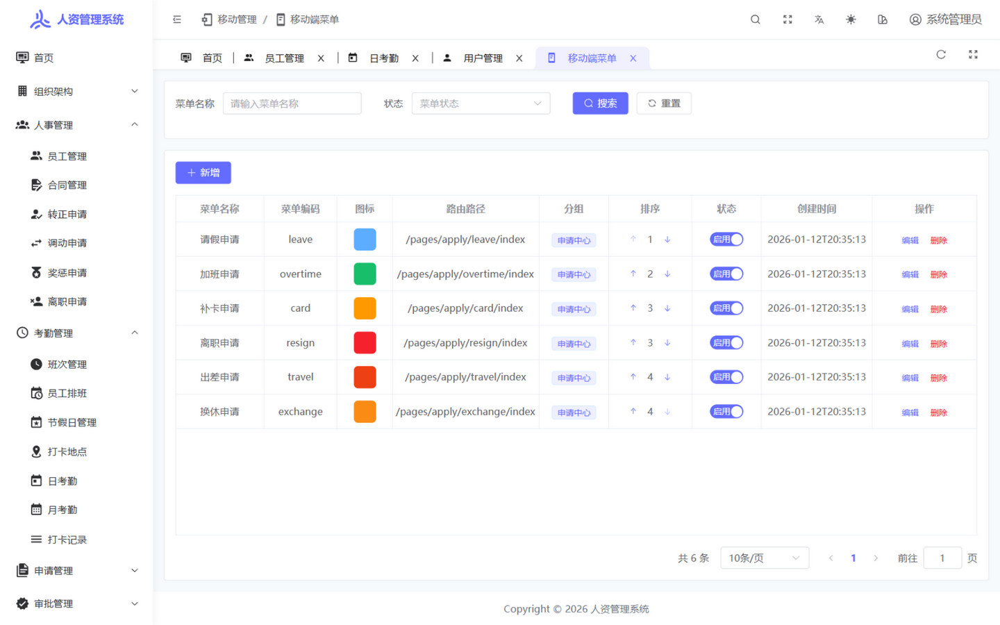 | 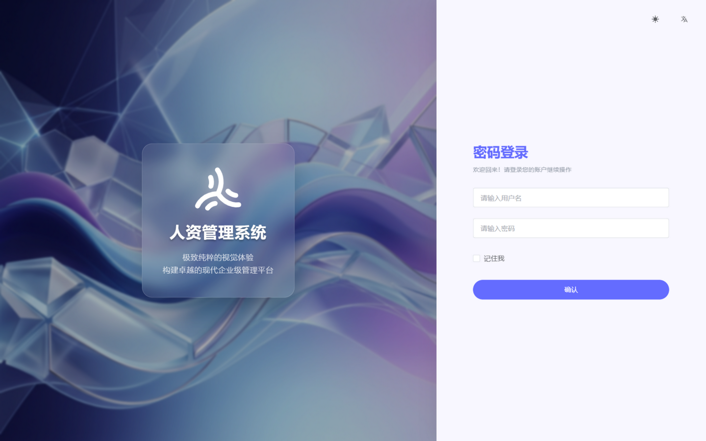 |

### 移动端(H5 / 微信小程序)

| 登录 | 首页 | 时光动态 | 工作台 |
| --- | --- | --- | --- |
| 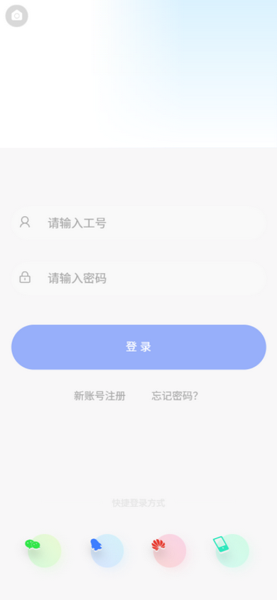 | 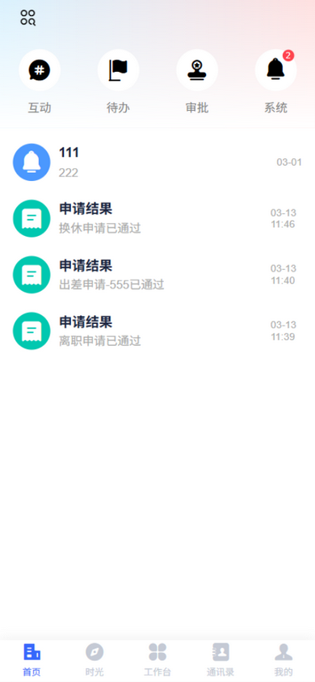 | 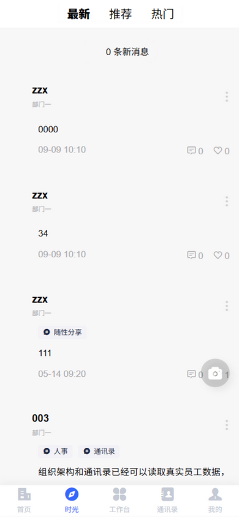 | 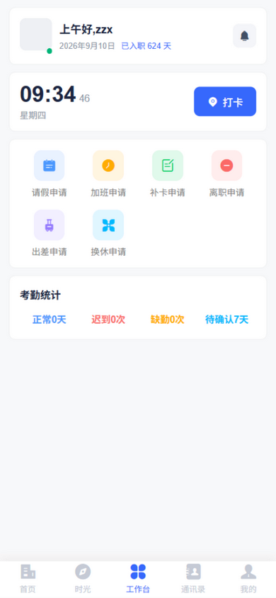 |

| 通讯录 | 组织架构 | 即时聊天 | 同事详情 |
| --- | --- | --- | --- |
| 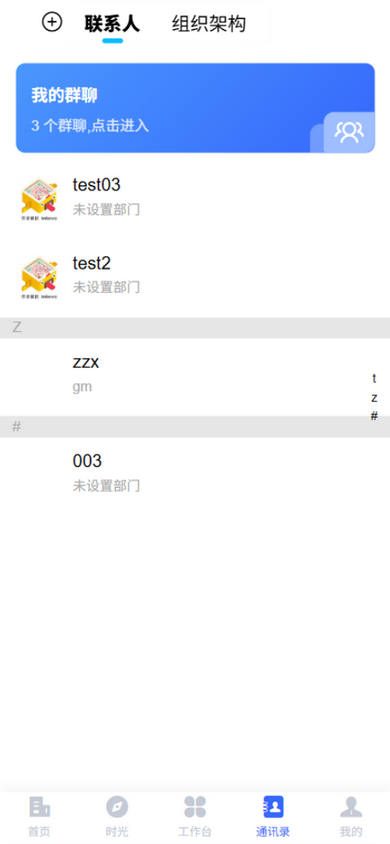 | 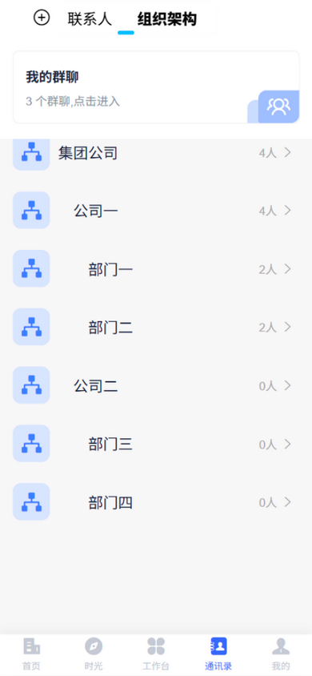 | 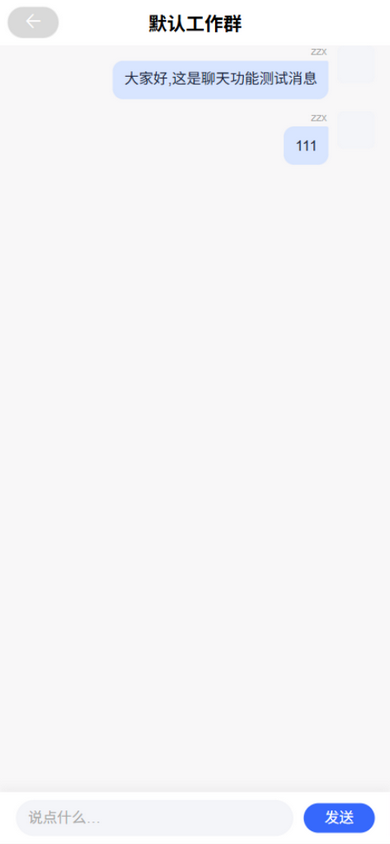 | 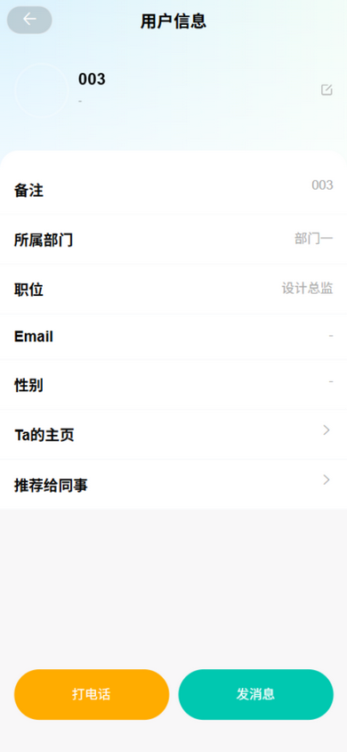 |

| 考勤打卡 | 考勤日历 | 请假申请 | 我的申请 |
| --- | --- | --- | --- |
| 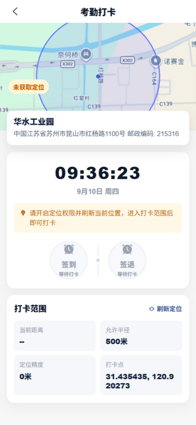 | 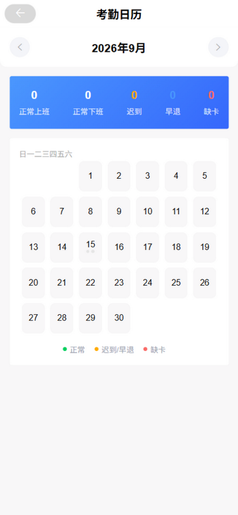 | 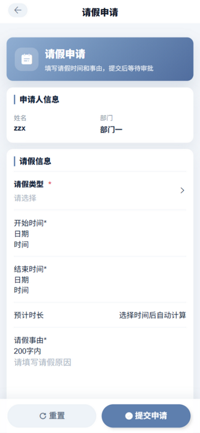 | 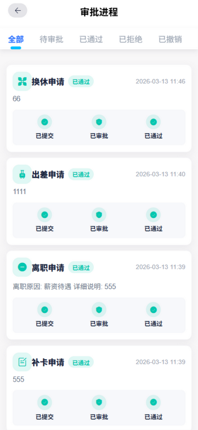 |

| 待办审批 | 系统公告 | 个人中心 |
| --- | --- | --- |
| 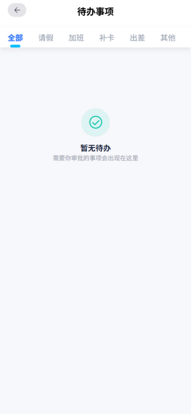 | 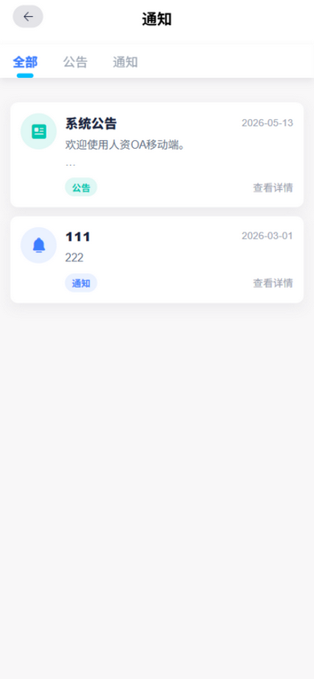 | 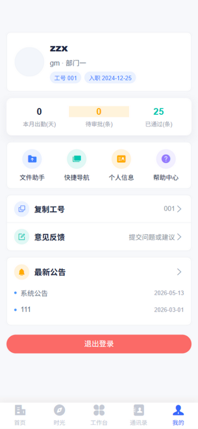 |

---

## 项目简介

KAdmin 是一套前后端分离的人力资源管理系统,由三部分组成:

- **后端**:Spring Boot 3 多模块单体,统一提供 REST API(含 PC 后台与移动端接口)
- **后台管理端(frontend)**:基于 Soybean Admin 深度定制的 PC 管理界面
- **移动端(uniapp_h5)**:基于 UniApp + Vue 3,一套代码编译 H5 与微信小程序

移动端围绕员工日常场景设计:打卡、查考勤、提申请、等审批、发动态、和同事聊天,后台管理员在 PC 端完成组织与人事数据维护、审批处理和移动端菜单配置。

## 功能模块

### 后台管理端

- **组织架构**:公司管理、部门管理,树形结构
- **人事管理**:员工信息(教育/工作经历、证书、Excel 批量导入)、合同管理、转正/调动/离职/奖惩
- **考勤管理**:班次管理、员工排班、日考勤、月考勤、节假日登记
- **申请管理**:请假、加班、补卡、出差、换休、离职等申请查询与处理
- **审批管理**:多级审批流程节点配置,审批按节点顺序逐级流转(含审批进度时间线)
- **报表管理**:考勤/人事统计报表(含图表)、员工花名册/日考勤/月考勤/合同台账 Excel 导出
- **系统管理**:用户、角色、菜单(多语言)、字典(多语言)、操作日志审计(支持时间范围筛选)
- **移动管理**:移动端工作台菜单可视化配置、通知公告、意见反馈处理

### 移动端

- **首页**:考勤/待办/审批统计卡片、消息中心(站内通知:审批结果/待办/到期提醒)、系统公告(已读标记)
- **时光**:企业内部动态社区,发布动态(图/文/话题)、点赞、评论、互动消息中心
- **工作台**:动态菜单、今日时钟、快捷发起各类申请
- **通讯录**:全员联系人(拼音索引)、组织架构、部门成员
- **即时聊天**:最近会话列表(未读数角标)、群聊与同事单聊、增量轮询
- **考勤**:GPS 定位打卡(上/下班)、月度考勤日历(正常/迟到/早退/缺卡标注)
- **申请**:请假、加班、补卡、出差、换休、离职,提交后实时跟踪审批进度,待审批可撤销;费用报销/设备申请页支持真实提交
- **我的**:个人信息、头像上传、修改密码(改密后强制重新登录)、快捷导航、意见反馈

## 技术栈

### 后端

| 技术 | 版本 | 说明 |
| --- | --- | --- |
| Spring Boot | 3.2.1 | 基础框架 |
| Spring Security + JWT | - | 认证鉴权 |
| MyBatis-Plus | - | ORM |
| MySQL | 8.0+ | 主数据库 |
| Redis | 6.0+ | 缓存/Token |
| Knife4j | - | 接口文档 |
| Hutool | - | 工具库 |

### 后台管理端(frontend)

| 技术 | 版本 | 说明 |
| --- | --- | --- |
| Vue | 3.5 | 前端框架 |
| Vite (rolldown-vite) | 7.x | 构建工具 |
| Element Plus | 2.x | UI 组件库 |
| Pinia | 3.x | 状态管理 |
| UnoCSS | - | 原子化 CSS |
| TypeScript | - | 类型系统 |

> 基于 [Soybean Admin](https://github.com/soybeanjs/soybean-admin) 二次开发

### 移动端(uniapp_h5)

| 技术 | 说明 |
| --- | --- |
| UniApp(3.0 alpha,Vue 3) | 跨平台框架,编译 H5 / 微信小程序 |
| 图鸟 UI tuniaoui-vue3 | 移动端 UI 组件库 |
| Vuex 4 | 状态管理 |
| Vite 5 | 构建工具 |

## 目录结构

```
RenZi
├── backend              # 后端(Maven 多模块)
│   ├── kadmin-admin     # 启动模块 + Controller(含 /mobile/* 移动端接口)
│   ├── kadmin-mobile    # 移动端业务(动态、聊天、考勤、通讯录)
│   ├── kadmin-hr        # 人事域(员工/合同/申请/审批)
│   ├── kadmin-attendance# 考勤域
│   ├── kadmin-organization # 组织架构域
│   ├── kadmin-system    # 系统管理域
│   └── kadmin-framework # 安全/认证/通用配置
├── frontend             # 后台管理端(Vue3 + Element Plus)
├── uniapp_h5            # 移动端(UniApp,编译 H5 / 微信小程序)
├── sql                  # 数据库初始化脚本
└── docs/screenshots     # 展示截图
```

## 快速开始

### 环境要求

- JDK 17+(推荐 21)
- Node.js 20.19+(pnpm 8.7+)
- MySQL 8.0+、Redis 6.0+

### 1. 初始化数据库

```sql
CREATE DATABASE kadmin DEFAULT CHARACTER SET utf8mb4 COLLATE utf8mb4_0900_ai_ci;
```

导入 [`sql/kadmin.sql`](sql/kadmin.sql)。

### 2. 启动后端

修改 [`backend/kadmin-admin/src/main/resources/application-dev.yml`](backend/kadmin-admin/src/main/resources/application-dev.yml) 中的 MySQL / Redis 连接信息,然后:

```bash
cd backend
mvn package -DskipTests
java -jar kadmin-admin/target/kadmin-admin-1.0.0.jar --spring.profiles.active=dev
```

后端默认运行在 `http://localhost:8080`,接口前缀 `/api`,接口文档 `http://localhost:8080/api/doc.html`(Knife4j)。

### 3. 启动后台管理端

```bash
cd frontend
pnpm install
pnpm dev
```

访问 `http://localhost:9527`。

### 4. 启动移动端(H5)

```bash
cd uniapp_h5
npm install
npm run dev:h5
```

访问 `http://localhost:5173/h5/`。

### 5. 编译微信小程序

```bash
cd uniapp_h5
npx cross-env UNI_INPUT_DIR=. uni build -p mp-weixin
```

用微信开发者工具导入 `uniapp_h5/dist/build/mp-weixin` 即可(`manifest.json` 中替换为你自己的小程序 appid)。

## 默认账号

| 端 | 账号 | 密码 |
| --- | --- | --- |
| 后台管理 | admin | admin123 |
| 移动端(工号) | 001 | 123456 |

## 说明

- 移动端聊天为增量轮询刷新(4 秒,只拉新消息),如需实时推送可在此基础上接入 WebSocket
- 移动端考勤打卡地图使用 Google Maps,请在 `uniapp_h5/config.local.js` 中配置自己的 API Key
- 移动端接口统一在 `backend/kadmin-admin/.../controller/mobile/` 下,前缀 `/mobile/*`
- 安全基线:员工密码 BCrypt 加密存储(存量明文首次登录自动升级,设置/改密校验强度 6-20 位含字母数字);JWT 与 Redis 会话绑定,登出/禁用/改密即时生效;管理端接口仅管理员角色可访问;跨域来源通过 `CORS_ORIGINS` 环境变量收敛;身份证/合同/毕业证/证书图片已移出匿名白名单(仅管理员鉴权后访问),头像等公开目录 UUID 防枚举;接口返回不回显密码哈希
- 站内通知:审批结果、待审批、到期提醒统一写入 `sys_notification`,移动端消息中心/未读角标使用真实数据;公告支持已读标记
- 定时任务:每日凌晨 2 点自动核算前一日考勤,2:30 扫描未来 30 天内到期的合同/试用期/证书并写入站内通知;查询接口 `GET /reminder/list`
- 审计:员工增删改、审批、打卡补录、考勤锁定等关键操作自动记录操作日志(PC 端"系统管理-操作日志"可查)
- 报表:`/report/*` 全部为服务端聚合(参数化查询),仪表盘图表直连统计接口
